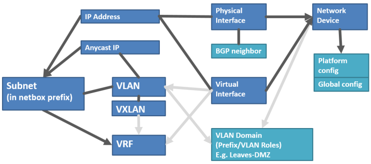

Netbox Ansible Network Device (NAND)
====================================


The Network Ansible Network Device Project (NAND) aims to provide a platform 
for network automation and orchestration. Usecase for the playbooks in this 
repository is to configure a Clos spine leaf switching fabric on CumulusLinux. 

Components used to build the software stack:

 - [Netbox](https://github.com/digitalocean/netbox) (used as source of truth (sot), input device data)
 - [netbox-joined-inventory](https://github.com/Sidarion/netbox-joined-inventory) 
 (get data out of sot and build YAML format variable files)
 - Netbox Ansible Network Device - push (ansible, j2 templates to build configuration 
 files and playbooks to push them to device)

The inventory of network devices and groups created by netbox-joined-inventory does not 
contain configuration data. Most configuration data is either stored in host 
specific variable files (host_vars, generated) or in group variable files 
(group_vars, specified manually).

Input files are generated in YAML format from this project:
<https://github.com/Sidarion/netbox-joined-inventory>

Netbox_joined_inventory is not a *dynamic* inventory script for Ansible.
A dynamic inventory script would immediately propagate changes in Netbox
to Ansible. Instead netbox_joined_inventory generates variables files.

The generated files can be committed to a repository. That way
differences to the previous set of configuration files can be reviewed
before applying them via Ansible playbooks.

The benefits: an audit trail, traceability, reproducibility,
the possibility to roll back and a clean separation between playbook
logic and sensitive config data.

Netbox Ansible Network Device - push
====================================
The "push" part of the NAND project focuses on building configuration files 
out of jinja2 templates and uses ansible playbooks to push them to the network 
devices. 

Playbooks in this repository rely on certain variable files which 
can be specified manually but for the best experience it is recommended to 
use the script (netbox-joined-inventory). For variables that need to be specified 
manually, example files are provided.

Target network architecture
===========================
The currently implemented architecture targets a spine-leaf deployment
over active-active datacenters - it works best within a scale of 50-4000
VLANs. Despite the assumed spine-leaf architecture, the script is
written fairly generically and should be adaptable to other
architectures and assumptions.

Ansible has many supported network devices:
<http://docs.ansible.com/ansible/latest/modules/list_of_network_modules.html>

Netbox_joined_inventory is primarily tested with CumulusLinux(CL) and
EdgeCore switches.

VXLAN is the de facto technology for implementing network virtualization
in the data center, enabling layer 2 segments to be extended over an IP
core (the underlay).  Ethernet Virtual Private Network (EVPN) is a
standards-based control plane for VXLAN defined in RFC 7432 and
draft-ietf-bess-evpn-overlay that allows for building and deploying
VXLANs at scale. It relies on multi-protocol BGP (MP-BGP) for exchanging
information and is based on BGP-MPLS IP VPNs (RFC 4364). It has
provisions to enable not only bridging between end systems in the same
layer 2 segment but also routing between different segments (subnets).
There is also inherent support for multi-tenancy. EVPN is often referred
to as the means of implementing controller-less VXLAN.

Network simulation
------------------
It is recommended to simulate and test a network configuration before deploying to
production. This is done using Vagrant and Cumulus VX, both of which are
free to use. There is a very comfortable prepared lab script for it:
<https://github.com/cumulusnetworks/cldemo-vagrant>

There you can test the above mentioned features:

- MLAG to dual-connect hosts at Layer 2 to two top of rack leafs and
  uses BGP unnumbered/L3 for everything above the leaf layer.

- EVPN on Cumulus Linux

Basic playbooks for configuring the CL switches:
<https://github.com/CumulusNetworks/cldemo-automation-ansible>

Run Configuration
=================
1. Prepare production or simulation environment (see above for Cumulus Linux 
demo environment).

2. Clone this repository to a system with ansible >= 2.4 installed and ideally 
with the netbox-joined-inventory script on it.

3. Take a look at the example files in `network-orchestrator/group_vars` and 
`network-orchestrator/snippets` and copy them to remove the `example.` in front 
of the file name. Change the variables for your needs. If you dont need static 
routing dont copy the snippet example. Please see the comments inside the example 
files for further details.

- if an interface needs custom settings, then set the interfaces as type "Other"
  in Netbox and add the special settings to
  `network-orchestrator/group_vars/all.yml` to the `other_interfaces` variable.

  An example of such a configuration can be found in
  `network-orchestrator/group_vars/example.all.yml`

4. If you take a look at the `sim-run.sh` script you can see a reference to a 
file that is not currently there `network-orchestrator/simulation-run.cfg`. If 
you want to push to a simulation environment just `cp production-run.cfg simulation-run.cfg` 
and change the parameters.

Notice: Ansible can work with ssh proxies. If your simulation is not reachable outside of the 
host try to define the following in your `simulation-run.cfg` and use your host as an ssh proxy:

```
ssh_args = -C -o ControlMaster=auto -o ProxyCommand="ssh -W %h:%p -q ansible@192.X.X.X"
```

5. Run the joined-inventory-script to get the device date from netbox. Data from the script 
needs to be put in the following directories:

- inventory file -> `network-orchestrator/inventories`
- device variable files (devicename.yaml) -> `network-orchestrator/host_vars`

6. run the playbooks with the `sim-run.sh` or `prod-run.sh` scripts from the root directory 
(prefered method, paramaters might need to be changed dependent on your setup) or run the 
playbooks `network-orchestrator/step2-deploy-simulation.yml`or `network-orchestrator/step2-deploy-simulation.yml` 
directly (attention: ansible configuration files might not be loaded properly)

Data model
==========
This example configuration groups together devices-Prefix/VLAN Roles-prefixes


